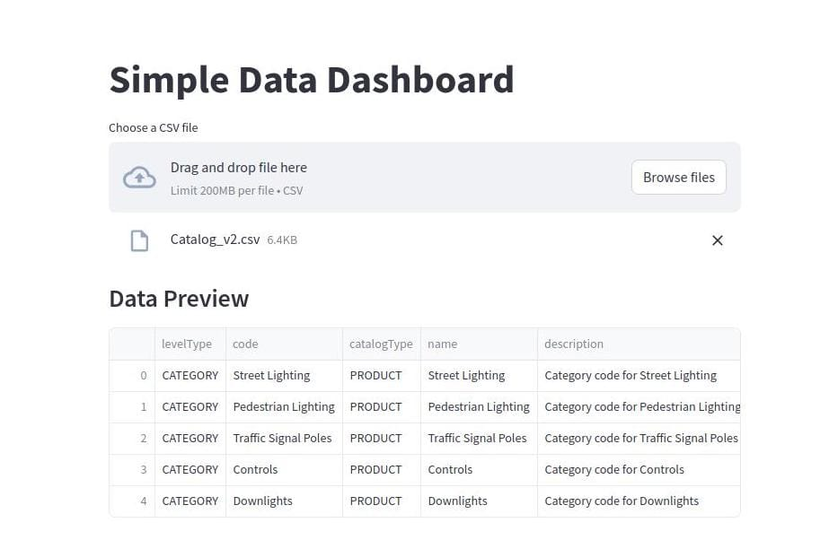

# Dashboard de Datos Simple

## Bienvenido a nuestro Dashboard de Datos

Este proyecto es una aplicación web interactiva construida con Streamlit que permite a los usuarios cargar, visualizar y analizar datos de manera sencilla y efectiva.

*Ejemplo de visualización del dashboard*

### Características Principales

- 📊 Carga de archivos CSV
- 📈 Visualización de datos
- 🔍 Filtrado dinámico
- 📉 Generación de gráficos interactivos
- 📋 Resumen estadístico de datos

### Tecnologías Utilizadas

- Python
- Streamlit
- Pandas
- Matplotlib

### Comenzar

Para comenzar a usar la aplicación, simplemente:

1. Clone el repositorio
2. Instale las dependencias con `pip install -r requirements.txt`
3. Ejecute la aplicación con `streamlit run main.py`

### Contribuir

¡Las contribuciones son bienvenidas! Si desea contribuir al proyecto, por favor:

1. Haga un Fork del repositorio
2. Cree una nueva rama para sus cambios
3. Envíe un Pull Request con sus mejoras

### Licencia

Este proyecto está bajo la licencia MIT. Ver el archivo `LICENSE` para más detalles. 